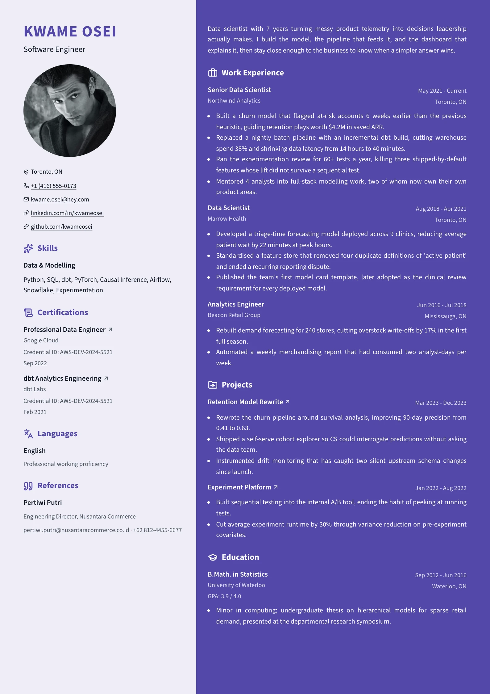
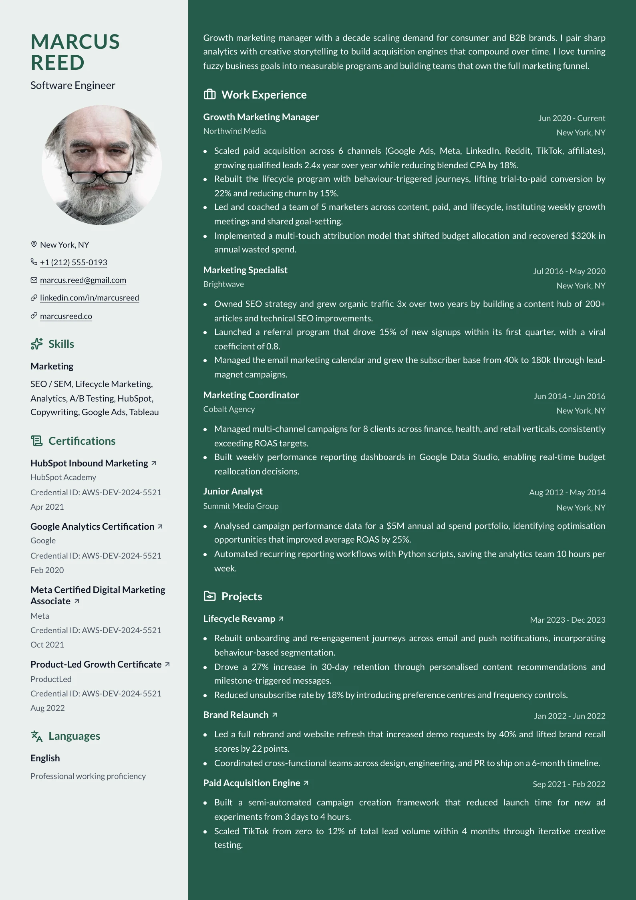
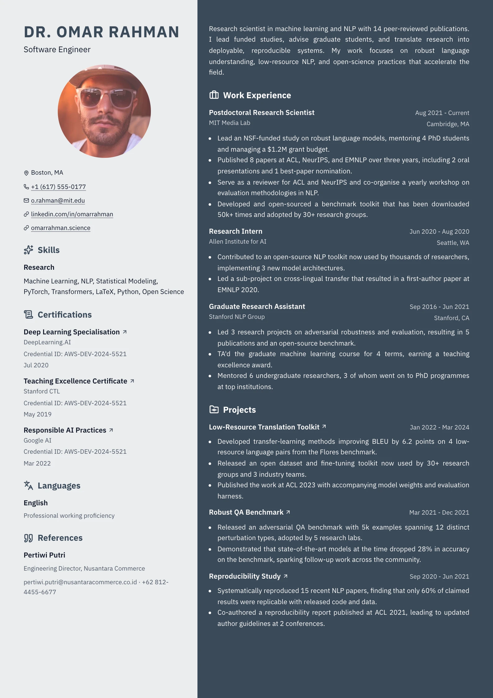

# Duotone

Two washes of one hue meeting at a hard vertical seam. A pale rail across the left two
fifths carries the identity — name, headline, photo, contacts — and the rail
sections (skills, languages, certifications, references). The wider right column
is filled with the accent at full saturation and holds the summary as an
unheaded lede, then experience, education, projects and the rest in light type.

Both columns bleed to the paper edge: the layout root takes no `page-inset`, and
each column pays its own margin, so the seam runs the full height of every sheet.

## Preview

| Iris | Pine | Slate |
| --- | --- | --- |
|  |  |  |

## What is doing the work

**The two washes.** The rail is `--resume-secondary-tint` (the second hue, or the
accent when none is set, at 90% white); the main column is `--resume-accent`
flat. One colour choice paints the whole page, which is why the presets keep the
accent dark enough to carry light type at body size.

**The neutral fold.** The shared neutral ramp assumes a white page — grey body
text on a saturated fill is unreadable and a grey hairline is invisible. The
main column folds `--resume-text`, `--resume-muted` and `--resume-border` back
onto `--resume-on-accent` at varying alpha, the same move `monolith` makes.

**Icon headings on both sides.** `renderIconSectionHeading` badges every heading;
the glyph is the only shape either column carries. On the tint it takes the
accent, on the fill the foreground, because a mid-tone glyph vanishes against a
saturated ground.

**The rail stacks.** Even at two fifths an item header laid out as a row has nowhere to
put its date, so the rail uses `RailSkillsItem` / `RailLanguagesItem` and stacks
`.item-header` and `.item-row` vertically — shared with `split` and `dossier`.

## Rules it follows

- Photo is natively a circle; `--resume-photo-aspect` / `-radius` are consumed as
  `var(…, <default>)`, and the id is listed in `roundPhotoLayoutFlatRadius` so a
  square or rectangle pick actually flattens it.
- Link cue is a `color-mix` hairline at 40% of the current colour — the headings
  are bold and badged, so anything stronger would out-shout them. Item titles
  drop the rule entirely and take the `arrow` marker instead.
- Both `print-color-adjust` properties on each painted column, or the page
  exports as two blank white halves.

## What it is not

There is no skill-proficiency bar. `skillCategoryItemSchema` stores skills as a
plain list of strings with no level, and a bar drawn from nothing would be a
chart of invented data. Languages keep their free-text proficiency as a caption.

## ATS

Rated `fail`. Two columns are read straight across by a parser, so the rail
jumbles into the experience — and the main column is a saturated fill behind
light type, which some pipelines flatten to grey and most mono printers ruin.
Use a single-column layout if the file may be parsed or printed.
