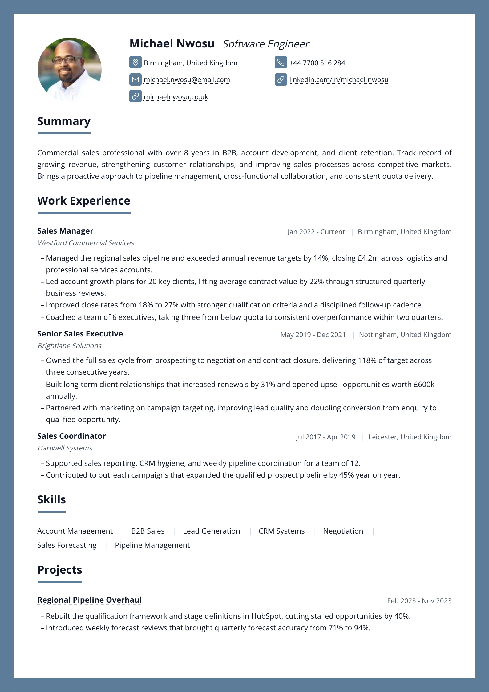
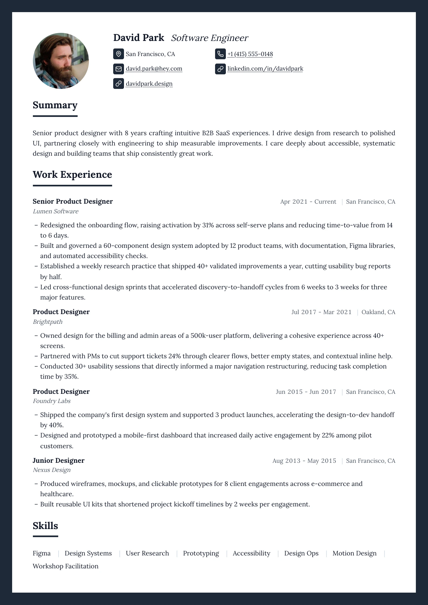
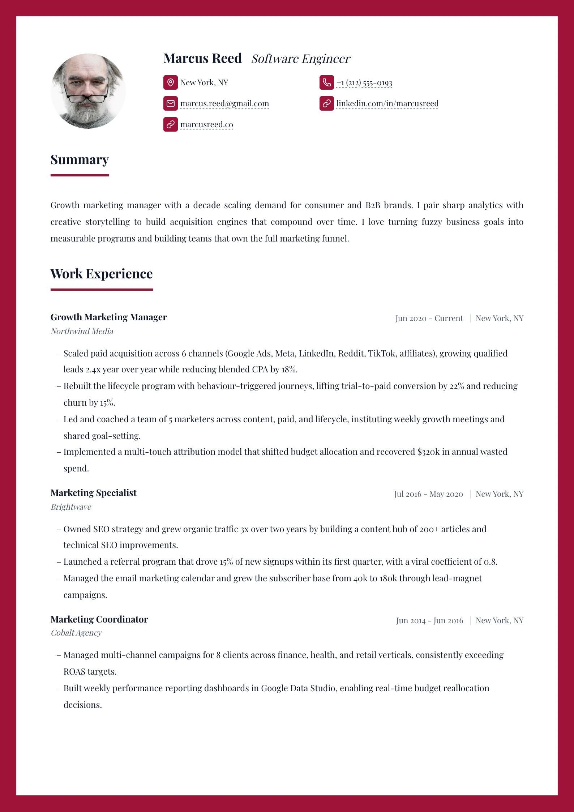

# Folio — `folio`

## Preview

| Folio Slate | Folio Ink | Folio Claret |
| --- | --- | --- |
|  |  |  |

A framed page. Every sheet carries the same ruled border, inset from the paper
edge, and the body inside it is a plain single column: a centred round-photo
header, section headings each closed by their own rule, and dated entries with
the date and place ranged right. The short closing sections — skills,
languages, certificates — pair off two-up so the foot of the page reads as a
band rather than a column of stubs.

Replaces `modern-centered`, which is mapped to this layout in `retiredLayoutIds`
so saved drafts land here instead of falling back to `classic`.

## What you would see

- **The frame** — a `2px` accent rule inset `6mm` from all four paper edges, **on every sheet**. Page margin is `16mm`, so content clears the frame by 10mm.
- **Header** — round photo (84px, `1 / 1`, radius 50%) with the name and the role on one line beside it, the role italic and muted. Under both, the reach as a **two-column grid** of iconed fields.
- **Section headings** — `1.05 × h2`, weight 700, sentence case, closed by a `1.5px` accent rule that is the heading's **own `border-bottom`** with `3px` of padding under the text.
- **Items** — title bold at `h3`, employer italic beneath it, date and place ranged right **on one line** separated by a hairline pipe. The pipe is drawn on the second child, so an item with only a date shows no orphaned separator.
- **Bullets** — en-dashes via `::marker`, not discs: at this size a disc reads heavier than the type it introduces.
- **The two-up tail** — two *adjacent* compact sections (skills, languages, certifications, references, awards) are set side by side. Adjacent only, so the user's chosen section order is never rearranged — just laid out two-up where it already reads that way.
- **Link cue** — `underline dotted`. The headings already own a solid rule; the links take the plainly quieter one.

## Wiring

Own `Component` (the two-up tail needs to group adjacent slots) · own `Header` ·
shared `defaultItemViews` · no `hideSummaryHeading` — Summary keeps its heading,
like every other ruled section.

## Watch out

- **The frame is four tiled background layers, not a `border`.** A border on this
  element would frame the whole stack once, not each sheet — and the page-break
  markers in `document-root.tsx` are editor-only chrome (`print:hidden`), so
  there is nothing per-page to hang it on. Each layer is sized to exactly
  `var(--resume-paper-height)` and set to `repeat-y`, so the tile lands at the
  same offset on every page. The two horizontal rules carry their length in
  `background-size`; the two vertical ones carry their extent in the gradient's
  colour stops, so the corners meet.
- **Both `print-color-adjust` properties** are on it. It is a painted
  background: drop either and the exported PDF has no frame at all, which is the
  entire design.
- **The frame follows `--resume-paper-height`**, so it is already correct for A4,
  Letter and JIS B5. Hard-coding 297mm would silently break two of the three.
- **The accent needs body.** It draws a 2px rule around the whole sheet as well
  as every heading underline, so a pale tint reads as a smudge at that width.
