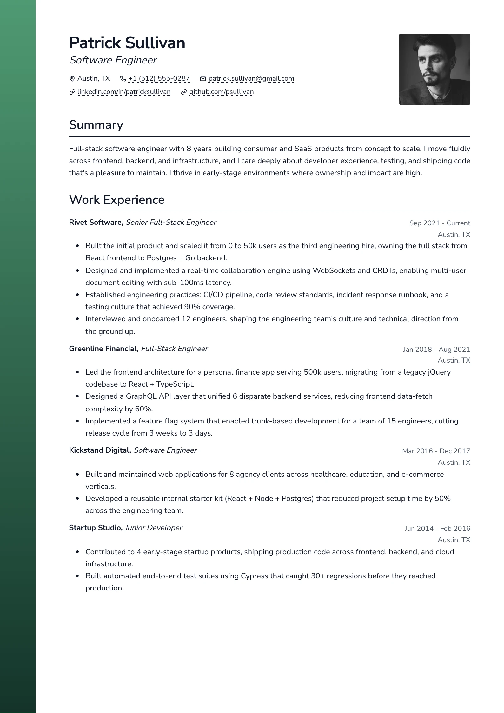
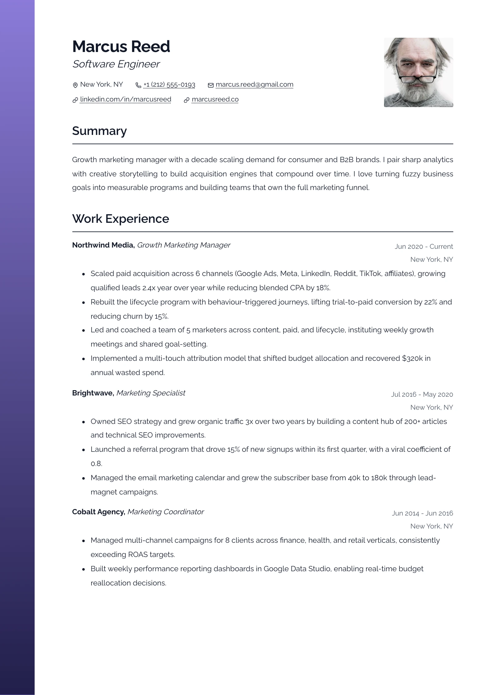
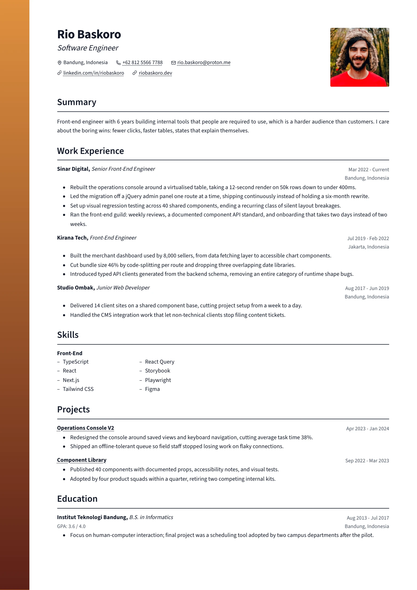

# Meridian — `meridian`

## Preview

| Meridian Fern | Meridian Dusk | Meridian Ember |
| --- | --- | --- |
|  |  |  |

A gradient rail down the left edge of **every** sheet — accent at the head,
secondary at the foot — and beside it a plain black-on-white column: the name
over an italic role, the reach in two iconed rows, a squared photo held top
right, and section headings each closed by a rule the full width of the column.

**The rail is the only colour on the page.** Name, headings, rules, dates and
bullets are all the neutral text ramp. That is what lets the rail read as a
gradient rather than as decoration, and it is why both curated colours land in
one place instead of being spread over the body.

## What you would see

- **The rail** — `7%` of the paper width, bleeding to the top, left and bottom edges of every sheet. It cannot be a child element: that paints one strip down the whole stack, and the page-break markers are editor-only chrome, so there is nothing per-page to hang one on. It is one background layer tiled to exactly one `--resume-paper-height` and repeated down the page. Reading the paper height rather than a fixed millimetre keeps it correct at A4, Letter and JIS B5 alike.
- **Header** — name (`0.95 × h1`, bold) over an italic role (`0.6 × h1`), the reach beneath in two iconed rows, and a `112px` square photo ranged right. The photo is sized to land level with the foot of the identity block; taller, and it opens a gap under the contacts that reads as a broken margin.
- **Section headings** — `1.3 × h2`, semibold, title case, with a `1.5px` `border-bottom` in the text colour. A real border on the heading rather than a separate element, so the rule can never drift out of alignment with the words it belongs to.
- **Items** — employer bold, comma, role italic, all on the title line (`TitleWithSubject`, shared with marquee, which puts them the other way round). Date over place ranged right; the description hangs at `--resume-indent` so it stays tied to its own entry once several stack up.
- **Skills** — groups two across, each a bold heading over a dashed list. A **single** group instead runs its own terms two-up (`:has(> .item:only-child)`), because the stock draft ships one group and it would otherwise fill column 1 and leave column 2 empty.
- **Certificates** and **languages** — one running line each, bullet-separated by a CSS `::after` so the separator never leads a wrapped line or lands in a paste. Languages keep the bold name and a parenthesised level; certificates read as prose.
- **Link cue** — `underline dotted`. Item titles inherit it rather than grading down further: a title here is bold body text, not the display type it is in a badge layout.

## Wiring

`createSingleColumnLayout` with `inset: "none"` · own `Header` ·
`meridianItemViews` = `defaultItemViews` plus work / education / skills /
certifications / languages · no `renderSection` override — the two inline
sections and the skills grid are all CSS.
