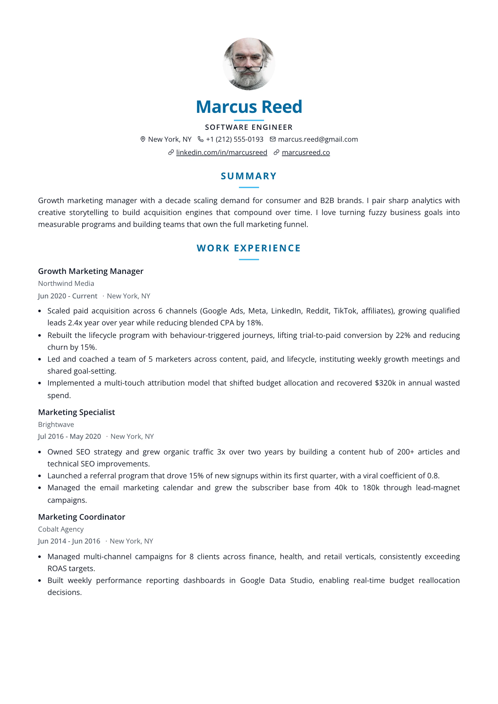
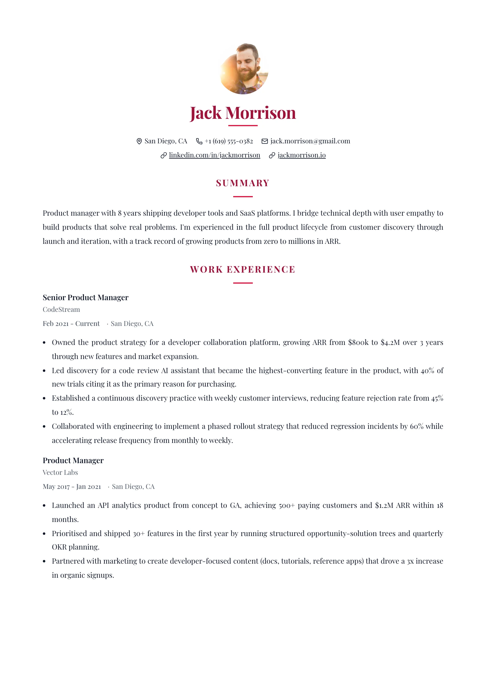

# Modern — `modern-centered`

## Preview

| Centered Ocean | Centered Editorial |
| --- | --- |
|  |  |

Everything about the identity is centred: a round photo, the name beneath it with
a short coloured rule under that, then the contacts on one centred line. The body
below reads down the left edge as normal, and each section heading is centred too,
with its own short rule underneath. Two rule lengths — 48px under the name, 32px
under each heading — are the layout's whole signature.

## What you would see

- **Page shape** — one column. Only the header and the headings are centred; item text is left-aligned.
- **Header** — vertical stack, centre-aligned: photo, name, headline, contacts.
- **Name** — accent colour (the shared default), with an absolutely-positioned 48px × 2px `--resume-secondary` rule centred beneath it.
- **Headline** — `0.42 × h1`, uppercase, tracked `0.1em`, weight 600, in `--resume-text`.
- **Section headings** — centred, uppercase, tracked `0.12em`, with a 32px × 2px secondary rule centred underneath via `::after`.
- **Items** — the item header **stacks**: title on top, then date and meta together on the row below, both left-aligned, joined by a `·`. Nothing is pushed to the right margin.
- **`.item-row`** (languages) also stacks, so the proficiency doesn't strand itself against the right edge while everything else hugs the left.
- **Photo** — 84px, circular by default, centred.
- **Link cue** — plain underline at `0.18em`; the centred secondary rules are the strong marks.

## Wiring

`createSingleColumnLayout` · `defaultItemViews` · own `header.tsx`.

## Careful

Both rules are `--resume-secondary`, which falls back to the accent when a preset
leaves it unset — a one-hue résumé still reads correctly, just quieter. The
`::after` rules paint, so both `print-color-adjust` properties are required and
already set; don't drop them when editing.
