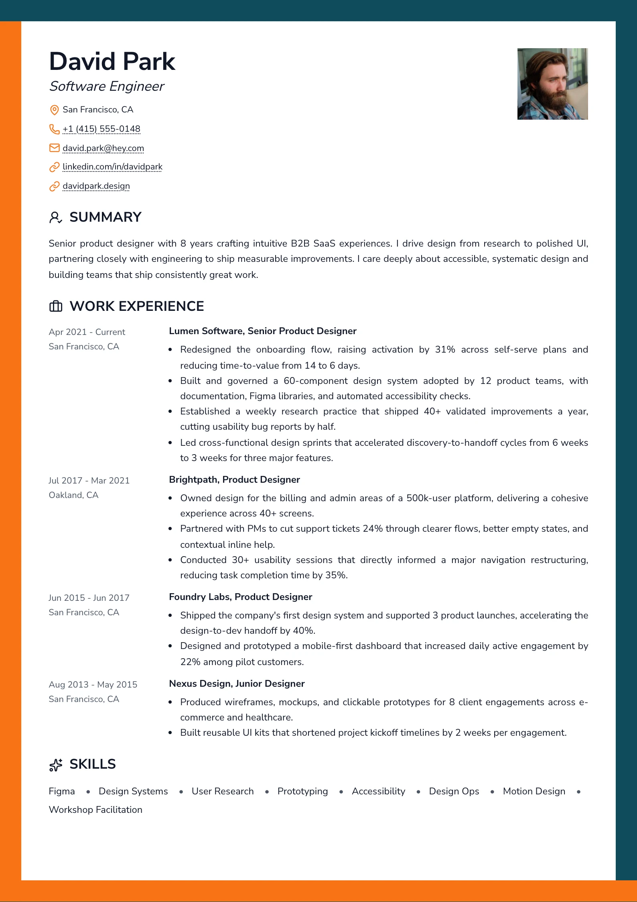
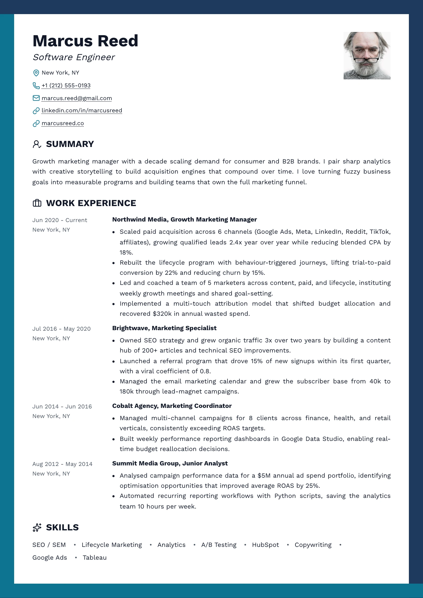
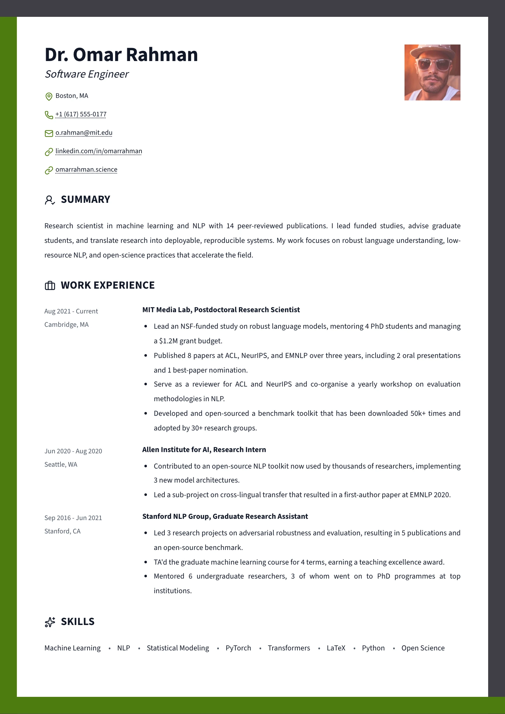

# Portico — `portico`

## Preview

| Portico Ember | Portico Harbour | Portico Olive |
| --- | --- | --- |
|  |  |  |

A page framed in two colours. Every sheet carries the same band bleeding to all
four paper edges — **accent down the left and along the bottom, secondary across
the top and down the right** — and inside it a plain single column: the name
ranged left with the role italic under it, contacts stacked under accent glyphs,
a square photo held at the far right, and every section headed by an outline
icon and a line of capitals over a fixed date gutter.

**Both colours are load-bearing.** This is one of the few layouts where a preset
that omits `secondary` would visibly lose half the design, so all three set it.
Inside the frame the page is black on white; the frame is the whole colour budget.

## What you would see

- **The frame** — a `7mm` band reaching every paper edge, **on every sheet**, in two colours meeting at butt joints. Page margin is `16mm`, so content clears it by 9mm.
- **Header** — identity ranged left, square photo (`3.2 × h1` wide, `1 / 1`, radius `0`) at the far right. Name at `1.15 × h1` bold, role italic at `1.15 × h2`, both in `--resume-text`.
- **Contacts** — stacked one per line, each led by a `14px` **outline accent glyph**. The only accent inside the frame.
- **Section headings** — an outline icon then the words in caps at `1.15 × h2`, near-black. No rule, no fill: a third painted surface inside a painted frame reads as a competing edge.
- **Items** — a two-track grid: a fixed `140px` gutter carrying the date and, stacked under it, the place; the right track carrying a bold title (`companyName, position`), an italic subtitle, and the body. The gutter is fixed rather than content-sized so a long range and a bare year still leave both bodies on one left edge.
- **Skills** — one running line of bullet-separated terms from every group, via a `renderSection` override. The separator is a CSS `::after`, so it never trails the last term or gets copied into a paste.
- **Link cue** — contacts take `underline dotted`; item titles drop the rule (`--resume-link-title-decoration: none`) and take the `link` glyph instead, because the headings are already iconic and a bold `h3` wearing the contact rule would carry two marks.

## Wiring

`createSingleColumnLayout` with `renderIconSectionHeading` · a `renderSection`
override for the skills line · own `Header` and `itemViews` ·
`titleLinkMarker: "link"` · no `hideSummaryHeading` — Summary keeps its heading
and its icon like every other section.

## Watch out

- **The frame is four tiled background layers, not a `border`.** A border frames
  the whole stack once, not each sheet, and the page-break markers are
  editor-only chrome, so there is nothing per-page to hang one on. Each layer is
  sized to exactly `var(--resume-paper-height)` and set to `repeat-y`, so the
  tile lands at the same offset on every page — and it is therefore already
  correct at A4, Letter and JIS B5.
- **Layer order is the design.** The top and bottom layers are listed first,
  which puts them over the side layers and gives the frame its butt joints.
  Reordering them moves every corner.
- **`--resume-secondary` falls back to the accent** when a user clears it, and
  the frame then reads as one colour rather than breaking — but the presets all
  set it, and a new one should too.
- **Both `print-color-adjust` properties** are on the frame *and* on the contact
  glyphs. Drop either and the exported PDF loses the frame, which is the design.
- **Every item keeps the two-track grid**, skills and languages included: an item
  view with foreign DOM drops its children into the date gutter.
