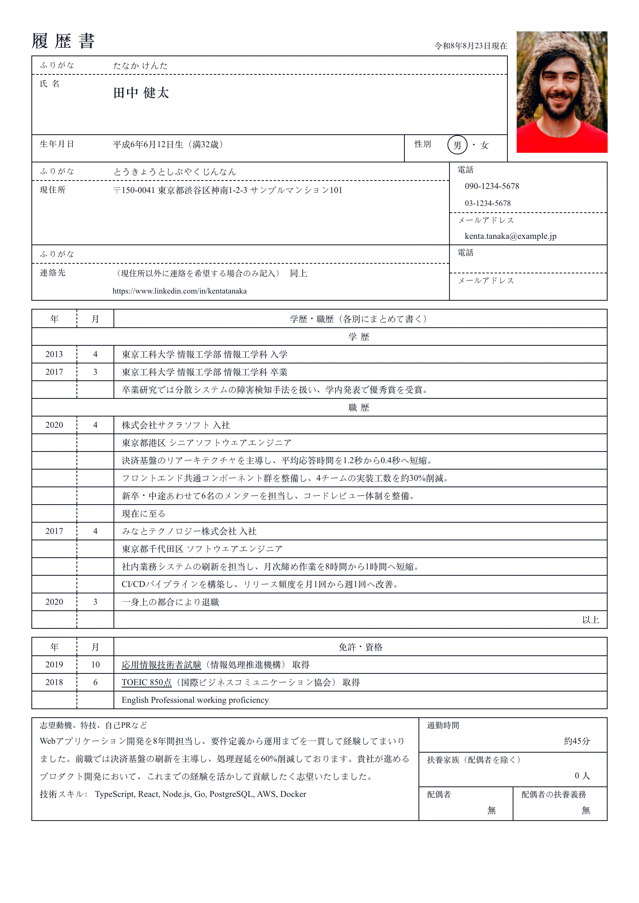

# Rirekisho — `rirekisho`

## Preview

| Rirekisho Gothic | Rirekisho Mincho |
| --- | --- |
|  |  |

The Japanese 履歴書, reproduced as a form rather than a résumé. Every block is a
ruled box: an identity table with a 30×40mm photo cell, an address table under
it, then the whole history in fixed 年 / 月 columns. The rules are not
decoration — they are the format, so nothing here has gaps between sections.

## What you would see

- **Page shape** — one column, 12mm margins. The boxes reach almost to the paper edge because the form, not the whitespace, frames the page.
- **Title** — 履歴書 at `0.7 × h1` with `0.5em` tracking, and the draft's `updatedAt` on the right as `YYYY年M月D日現在`.
- **Identity box** — ふりがな / 氏名 / 生年月日 + 性別 / 職種, each a labelled cell; the 氏名 row takes the slack so the block matches the photo's height.
- **生年月日** — `1994年6月12日生（満32歳）`. The age counts to the document's own as-of date (`updatedAt`), never to `new Date()`, so a render is reproducible.
- **Photo** — a 30mm box at `var(--resume-photo-aspect, 3 / 4)`, i.e. 30×40mm, square corners. Drawn whether or not a photo exists — an empty one reads 写真, exactly like a blank form.
- **Address box** — ふりがな / 現住所 (with 〒 prefixed to the postal code) / 電話 / メール / URL.
- **Section headings** — the shared `<h2>` becomes a ruled row of its own: `年 | 月 | title`, via `renderSectionHeading`. Summary is the exception; it renders as a plain prose box (志望の動機).
- **History rows** — work: `会社名 入社` at the start date, the role, the description, then `退職` at the end date or a dateless `現在に至る`. Education: `入学` / `卒業`. Certifications, awards and publications take a single dated row.
- **年 / 月** — split from the stored `MMM yyyy` via `parseMonthYear`. A date the month picker never produced (`current`, free text) leaves both cells blank rather than guessing.
- **以上** — a final right-aligned row closing the history table, as the form requires.
- **Link cue** — a plain underline at `0.15em`; the boxed bold headings can't be confused with it.

## What it demands of the document

All three knobs in `domain/presentation/layout-section-rules.ts`, and this is the
only layout that uses any of them:

- **Extra fields** — `nameReading`, `addressReading`, `postalCode`, `birthDate`
  and `gender`, read from the free `profile.extras` map. The editor shows them as
  a pinned **Rirekisho details** row in the section list, which appears only while
  this layout is selected. Values survive a switch away.
- **Fixed titles** — 学歴, 職歴, 免許・資格, 志望の動機, 特技・スキル, 語学. A
  recruiter looks for these exact words, so they outrank a rename and the rename
  control steps aside. The sidebar reads 職歴 (Work Experience); the paper prints
  職歴 alone.
- **Hidden sections** — projects, publications, awards, references and
  volunteering belong on the companion 職務経歴書. Their content is kept; the
  sidebar row is chipped "Not printed".

## Paper

A4 is the norm for a 履歴書 sent as a PDF. **JIS B5** (182×257mm) is the size the
printed form is sold and filed at, and is in the global paper picker for it —
`generate-resume-pdf.ts` passes explicit millimetres rather than puppeteer's
`format`, which has no B series.

## Wiring

Own `Component` (the 以上 row follows the sections, and the summary box follows
that) · own `rirekishoItemViews` (every item emits `.rirekisho-row` cells) ·
own `header.tsx` · `renderSectionHeading` for the 年 / 月 heading row.

## Careful

`.layout-body`, `.section`, `.item-list` and `.item` all run at `gap: 0` on
purpose: one gap anywhere breaks the ruled table into stripes. Every box sets the
`print-color-adjust` pair — the borders are painted, and without it the exported
PDF comes out blank. The ATS verdict is a deliberate `warn`: a 履歴書 is read by
a person, and saying otherwise would be a lie about the format.
